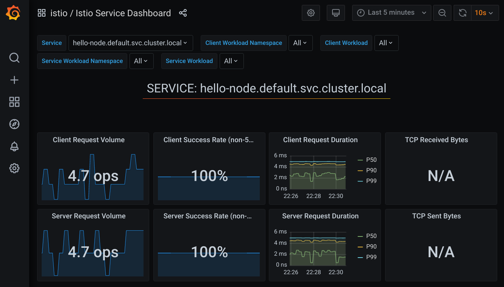
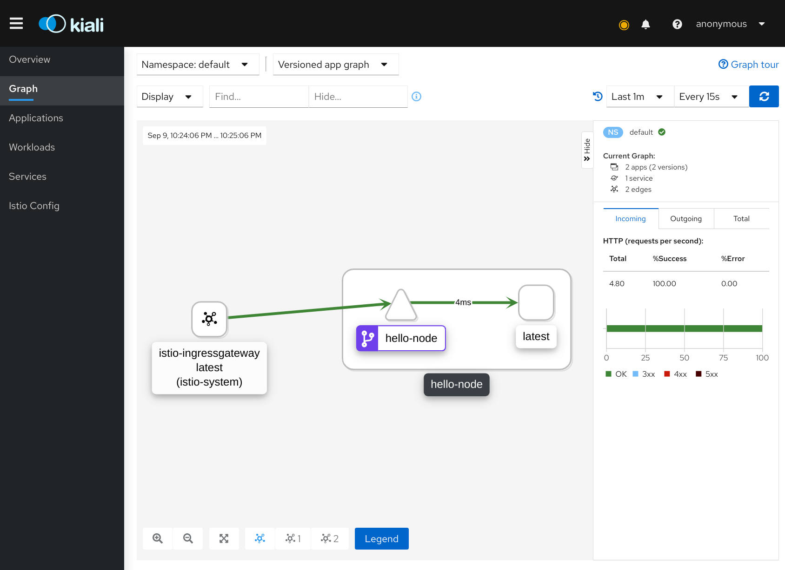
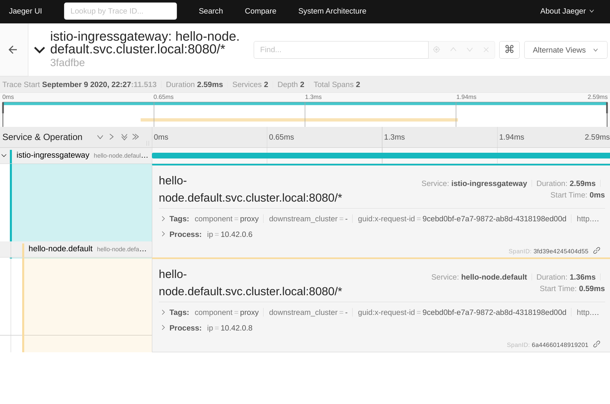

# Istio Test Setup

**WARNING**: updates your default kubeconfig. Make backup or move if needed

* Tried on linux
* Creates a local k3s cluster in docker with k3d
* Deploys istio and addons
* Deploys gateway config and test app

Requirements:

* k3d https://github.com/rancher/k3d#get
* istioctl https://github.com/istio/istio/releases/tag/1.7.0

Usage:

Most commands are in the [Makefile](Makefile)

```shell
# kick things off
make start

# install grafana, prometheus and friends
# NOTE: might need to run twice due to CRD registration delay
make istio-addons

# test the app works and fire some requests at it to generate traffic
make test

# view various dashboards
istioctl dashboard grafana
istioctl dashboard jaeger
istioctl dashboard kiali

# delete cluster
make delete
```

### Grafana



### Kiali



### Jaeger


